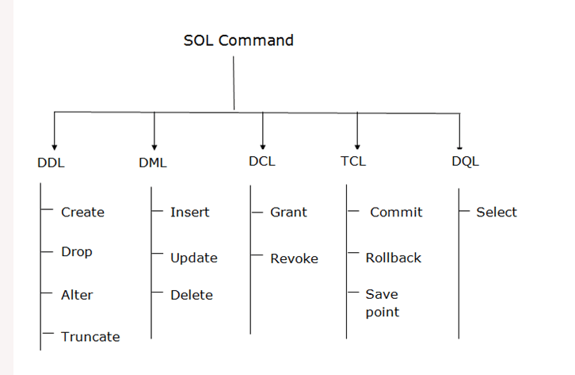

##  SQL | DDL, DQL, DML, DCL and TCL Commands
Structured Query Language(SQL) as we all know is the database language by the use of which we can perform certain operations on the existing database, and also we can use this language to create a database. SQL uses certain commands like Create, Drop, Insert, etc. to carry out the required tasks.
 1. **DDL** – Data Definition Language
 2. **DQl** – Data Query Language
 3. **DML** – Data Manipulation Language
 4. **DCL** – Data Control Language

#### Though many resources claim there to be another category of SQL clauses TCL – Transaction Control Language. So we will see in detail about TCL as well.


### DDL (Data Definition Language):
DDL or Data Definition Language actually consists of the SQL commands that can be used to define the database schema. It simply deals with descriptions of the database schema and is used to create and modify the structure of database objects in the database.DDL is a set of SQL commands used to create, modify, and delete database structures but not data. These commands are normally not used by a general user, who should be accessing the database via an application.
 
#### List of DDL commands:
- `CREATE`: This command is used to create the database or its objects (like table, index, function, views, store procedure, and triggers).
```sql
CREATE TABLE Persons (
    PersonID int,
    LastName varchar(255),
    FirstName varchar(255),
    Address varchar(255),
    City varchar(255)
);
```
- `DROP`: This command is used to delete objects from the database.

```sql
DROP TABLE table_name;
```
- `ALTER`: This is used to alter the structure of the database.
```sql
ALTER TABLE Persons
ADD Age int; 
```
- `TRUNCATE`: This is used to remove all records from a table, including all spaces allocated for the records are removed.
```sql
  TRUNCATE TABLE Persons;
```
- `COMMENT`: This is used to add comments to the data dictionary.
```sql
--SELECT * FROM Customers;
SELECT * FROM Persons;
```
-` RENAME`: This is used to rename an object existing in the database.
```sql
ALTER TABLE Persons
RENAME COLUMN Age TO Year;
```

#### DQL (Data Query Language):
**DQL** statements are used for performing queries on the data within schema objects. The purpose of the DQL Command is to get some schema relation based on the query passed to it. We can define DQL as follows it is a component of SQL statement that allows getting data from the database and imposing order upon it. It includes the SELECT statement. This command allows getting the data out of the database to perform operations with it. When a SELECT is fired against a table or tables the result is compiled into a further temporary table, which is displayed or perhaps received by the program i.e. a front-end.

#### List of DQL:
`SELECT`: It is used to retrieve data from the database.
```sql
SELECT * FROM table_name;
+--------+--------------+------------+--------+---------+
| emp_id | emp_name     | hire_date  | salary | dept_id |
+--------+--------------+------------+--------+---------+
|      1 | Ethan Hunt   | 2001-05-01 |   5000 |       4 |
|      2 | Tony Montana | 2002-07-15 |   6500 |       1 |
|      3 | Sarah Connor | 2005-10-18 |   8000 |       5 |
|      4 | Rick Deckard | 2007-01-03 |   7200 |       3 |
|      5 | Martin Blank | 2008-06-24 |   5600 |    NULL |
+--------+--------------+------------+--------+---------+
```
The SQL commands that deals with the manipulation of data present in the database belong to DML or Data Manipulation Language and this includes most of the SQL statements. It is the component of the SQL statement that controls access to data and to the database. Basically, DCL statements are grouped with DML statements.

#### List of DML commands: 
- `INSERT `: It is used to insert data into a table.
```sql
INSERT INTO Customers (CustomerName, ContactName, Address, City, PostalCode, Country)
VALUES ('Cardinal', 'Tom B. Erichsen', 'Skagen 21', 'Stavanger', '4006', 'Norway');
```
- `UPDATE`: It is used to update existing data within a table.

```sql
UPDATE Customers
SET ContactName = 'Alfred Schmidt', City= 'Frankfurt'
WHERE CustomerID = 1;
```
- `DELETE `: It is used to delete records from a database table.
```sql
 DELETE FROM Customers WHERE CustomerName='Alfreds Futterkiste'; 
```
- `LOCK`: Table control concurrency.
```sql
LOCK TABLES table_name [READ | WRITE]
--------------------------------------
UNLOCK TABLES;
```
- `CALL`: Call a PL/SQL or JAVA subprogram.
```sql
CREATE PROCEDURE procedure_name
AS
sql_statement
GO;
```
#### Execute a Stored Procedure
```sql
EXEC procedure_name;
```
- `EXPLAIN PLAN`: It describes the access path to data.

#### DCL (Data Control Language): 
DCL includes commands such as GRANT and REVOKE which mainly deal with the rights, permissions, and other controls of the database system. 

##### List of  DCL commands:
- `GRANT`: This command gives users access privileges to the database.
- `REVOKE`: This command withdraws the user’s access privileges given by using the GRANT command.

Though many resources claim there to be another category of SQL clauses TCL – Transaction Control Language. So we will see in detail about TCL as well. TCL commands deal with the transaction within the database.

##### List of TCL commands: 
- `COMMIT`: Commits a Transaction.
- `ROLLBACK`: Rollbacks a transaction in case of any error occurs.
- `SAVEPOINT`:Sets a savepoint within a transaction.
- `SET TRANSACTION`: Specify characteristics for the transaction.
